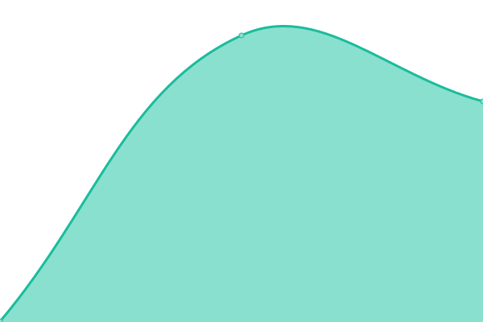

# [📈 Live Status](https://upptime.github.io/upptime): <!--live status--> **🟧 Partial outage**

This repository contains the open-source uptime monitor and status page for [Upptime](https://upptime.js.org), powered by [Upptime](https://github.com/upptime/upptime).

With [Upptime](https://upptime.js.org), you can get your own unlimited and free uptime monitor and status page, powered entirely by a GitHub repository. We use [Issues](https://github.com/upptime/upptime/issues) as incident reports, [Actions](https://github.com/upptime/upptime/actions) as uptime monitors, and [Pages](https://upptime.github.io/upptime) for the status page.

<!--start: status pages-->
<!-- This summary is generated by Upptime (https://github.com/upptime/upptime) -->
<!-- Do not edit this manually, your changes will be overwritten -->
<!-- prettier-ignore -->
| URL | Status | History | Response Time | Uptime |
| --- | ------ | ------- | ------------- | ------ |
|  Abatır | 🟩 Up | [abatir.yml](https://github.com/haliliceylan/uptime-haliliceylan/commits/HEAD/history/abatir.yml) | 

 412ms
     
 | 

<a href="https://haliliceylan.github.io/uptime-haliliceylan/history/abatir">100.00%</a>
    

|  Abamotors | 🟩 Up | [abamotors.yml](https://github.com/haliliceylan/uptime-haliliceylan/commits/HEAD/history/abamotors.yml) | 

 383ms
     
 | 

<a href="https://haliliceylan.github.io/uptime-haliliceylan/history/abamotors">100.00%</a>
    

|  Betmaster | 🟩 Up | [betmaster.yml](https://github.com/haliliceylan/uptime-haliliceylan/commits/HEAD/history/betmaster.yml) | 

 588ms
     
 | 

<a href="https://haliliceylan.github.io/uptime-haliliceylan/history/betmaster">100.00%</a>
    

|  diyetisyen | 🟩 Up | [diyetisyen.yml](https://github.com/haliliceylan/uptime-haliliceylan/commits/HEAD/history/diyetisyen.yml) | 

 510ms
     
 | 

<a href="https://haliliceylan.github.io/uptime-haliliceylan/history/diyetisyen">100.00%</a>
    

|  Minio | 🟥 Down | [minio.yml](https://github.com/haliliceylan/uptime-haliliceylan/commits/HEAD/history/minio.yml) | 

 373ms
     
 | 

<a href="https://haliliceylan.github.io/uptime-haliliceylan/history/minio">100.00%</a>
    

|  func | 🟥 Down | [func.yml](https://github.com/haliliceylan/uptime-haliliceylan/commits/HEAD/history/func.yml) | 

 381ms
     
 | 

<a href="https://haliliceylan.github.io/uptime-haliliceylan/history/func">100.00%</a>
    

|  portainer | 🟩 Up | [portainer.yml](https://github.com/haliliceylan/uptime-haliliceylan/commits/HEAD/history/portainer.yml) | 

 496ms
     
 | 

<a href="https://haliliceylan.github.io/uptime-haliliceylan/history/portainer">100.00%</a>
    

<!--end: status pages-->

[**Visit our status website →**](https://upptime.github.io/upptime)

## 📄 License

- Powered by: [Upptime](https://github.com/upptime/upptime)
- Code: [MIT](./LICENSE) © [Upptime](https://upptime.js.org)
- Data in the `./history` directory: [Open Database License](https://opendatacommons.org/licenses/odbl/1-0/)
